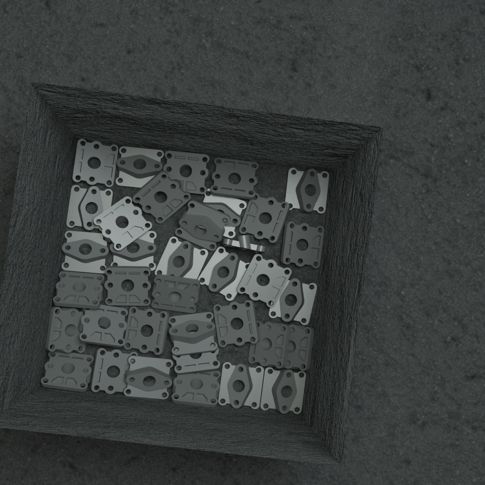
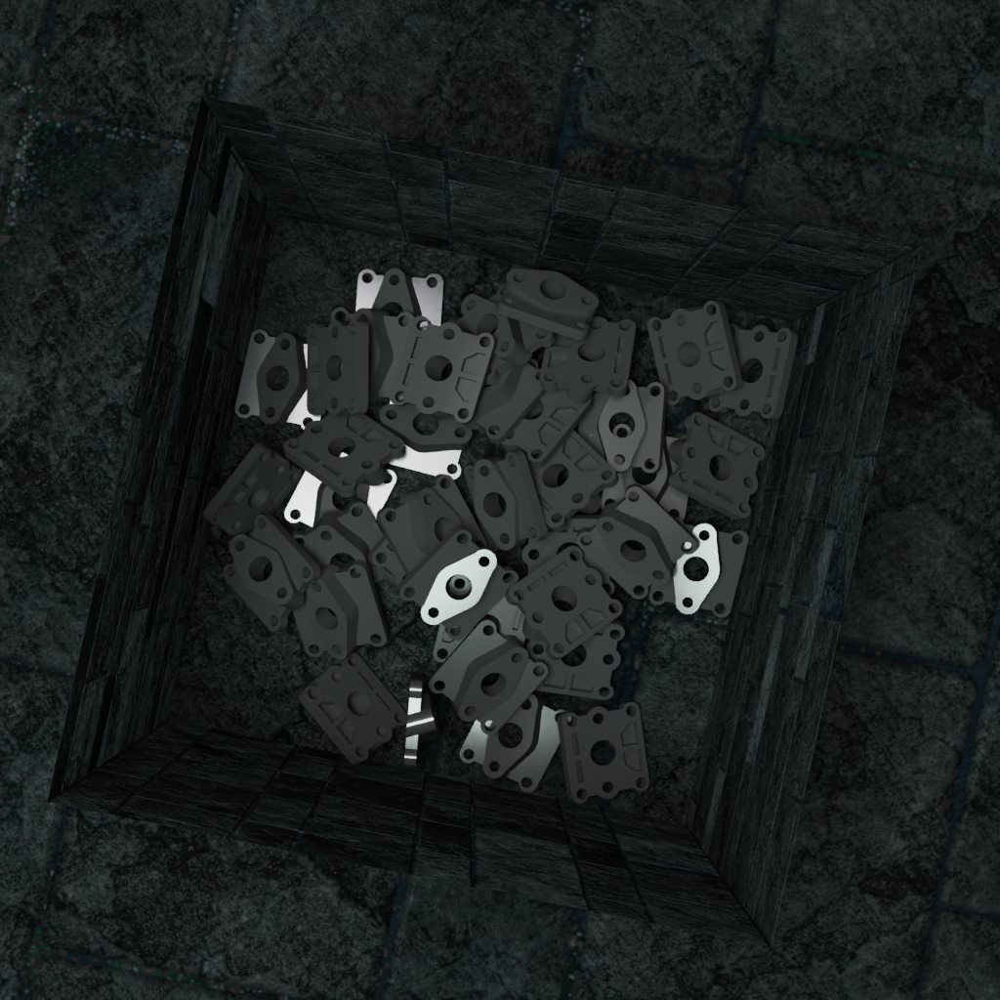
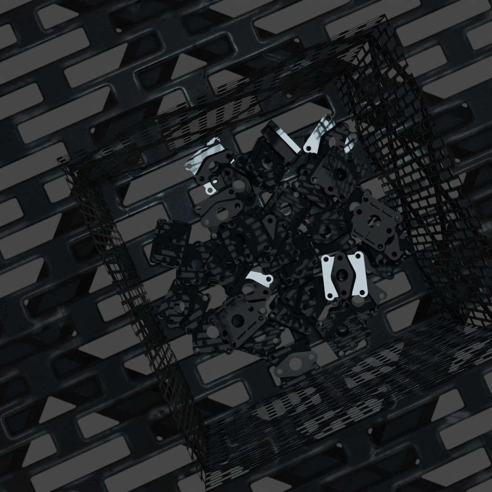
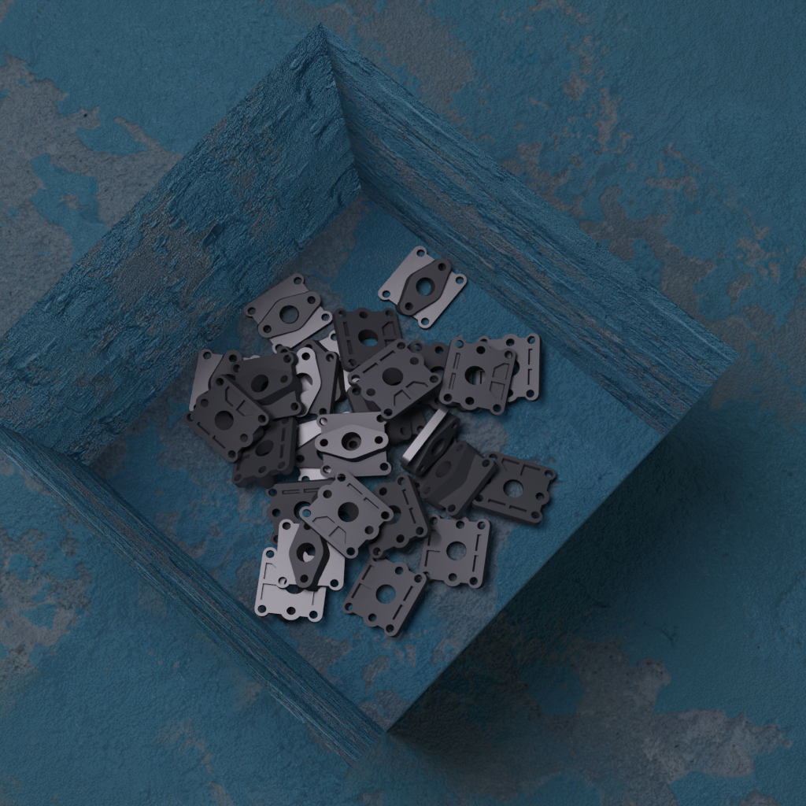

# bproc-launcher


## Dependency

- python3
    - loguru
    - omegaconf
    - textual

- docker
- nvidia-docker2

## Usage

```bash
# recommended step: pull latest docker image first
docker pull curioushi/bproc:latest

python bproc-launcher.py -h
# usage: bproc-launcher.py [-h] [-c CONFIG] [-t TEXTURES_DIR] [-g GPU] [-it] [-tui] model_path output_dir
# 
# positional arguments:
#   model_path            Path to object model, supported format: obj, stl, ply
#   output_dir            Output directory
# 
# optional arguments:
#   -h, --help            show this help message and exit
#   -c CONFIG, --config CONFIG
#                         YAML configuration file, used to configure the synthetic options.
#   -t TEXTURES_DIR, --textures_dir TEXTURES_DIR
#                         CC0 textures directory. Set this value to enable material randomization.
#   -g GPU, --gpu GPU     GPU ID, e.g. 0 will use the first gpu. (default=0)
#   -it                   Enter into container with interactive mode.
#   -tui                  Edit the YAML configuration with TUI.

# launch with default config
python bproc-launcher.py <model_path> <output_dir>

# launch with TUI, then you can setup the configuration interactively
python bproc-launcher.py <model_path> <output_dir> --tui

# enable texture randomization
python bproc-launcher.py <model_path> <output_dir> -t <texture_dir> -g 1

# use gpu 1
python bproc-launcher.py <model_path> <output_dir> -g 1

```

## ScreenShots









